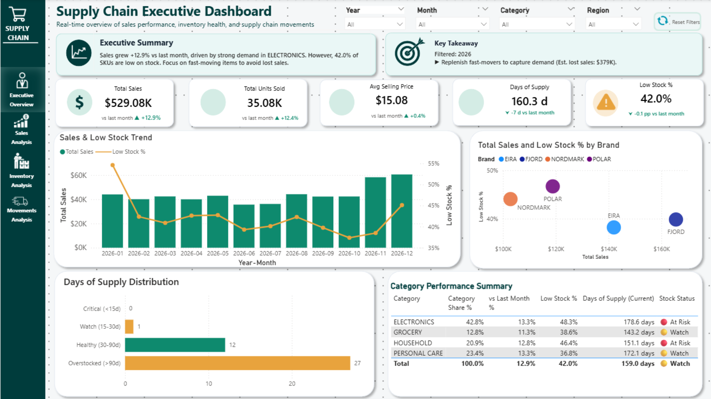
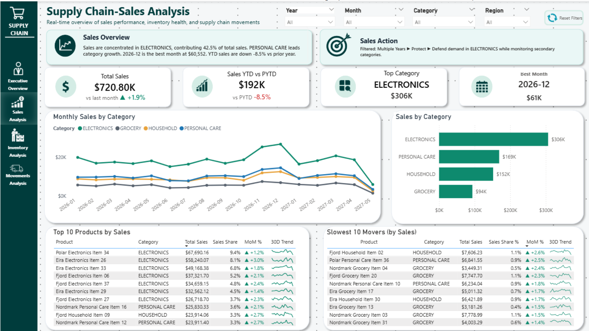
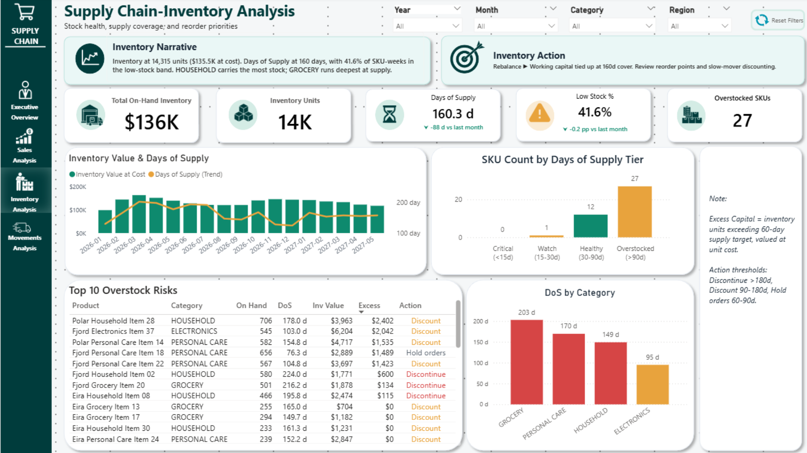
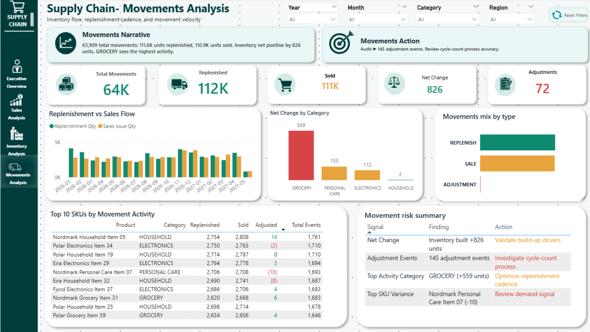
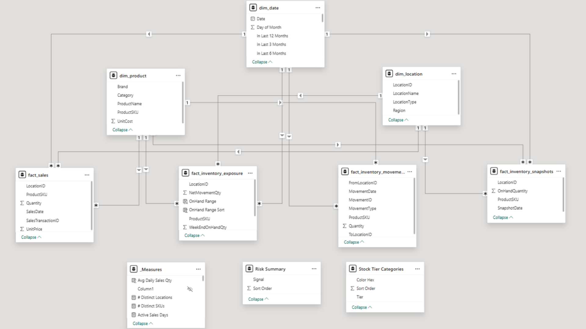
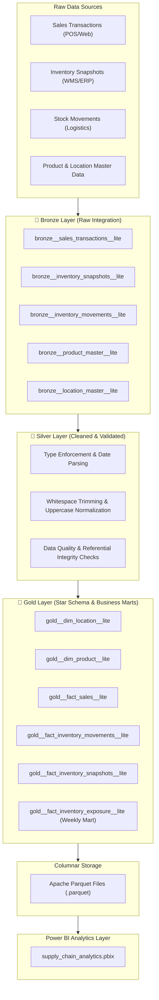

# 📦 Supply Chain Analytics & Inventory Intelligence Platform

[](https://www.python.org/)
[](https://duckdb.org/)
[](https://powerbi.microsoft.com/)
[](https://parquet.apache.org/)
[-success?style=for-the-badge)](./pipeline/)

An end-to-end modern supply chain intelligence solution designed to give operations leaders, inventory managers, and supply chain directors actionable visibility across sales velocity, inventory stockouts, product turnover, and warehouse transfers.

Powered by an **ELT pipeline in DuckDB**, **Apache Parquet** columnar storage, and an **interactive, production-grade Power BI dashboard**.

---

## 📑 Table of Contents

- [Business Context & Value Proposition](#-business-context--value-proposition)
- [Dashboard Preview & Visual Walkthrough](#-dashboard-preview--visual-walkthrough)
- [End-to-End Solution Architecture](#-end-to-end-solution-architecture)
- [Data Modeling & Star Schema](#-data-modeling--star-schema)
- [Key Business Metrics & DAX Formulas](#-key-business-metrics--dax-formulas)
- [Project Directory Structure](#-project-directory-structure)
- [Quickstart & Setup Guide](#-quickstart--setup-guide)
- [Technology Stack](#-technology-stack)
- [License](#-license)

---

## 🎯 Business Context & Value Proposition

Modern supply chains face persistent challenges: **inventory distortion (overstock vs. stockouts)**, **unbalanced warehouse utilization**, and **slow demand sensing**.

This platform unifies sales transactions, multi-facility inventory balances, and internal stock movements into a single source of truth:

1. **Eliminate Blind Spots:** Monitor real-time on-hand stock vs. weekly sales velocity across regional distribution hubs and stores.
2. **Prevent Stockouts & Excess Holding:** Identify fast-moving SKUs approaching critical safety stock thresholds before stockouts occur.
3. **Optimize Inventory Transfers:** Track inter-facility replenishment transfers to balance stock across distribution centers and retail stores.
4. **Fast Analytical Queries:** Query millions of supply chain records in sub-seconds using an in-process columnar SQL database (**DuckDB**).

---

## 📊 Dashboard Preview & Visual Walkthrough

### 1. 🏢 Executive Overview
*High-level executive KPIs summarizing overall sales revenue, units sold, average inventory levels, and stockout vulnerability.*



---

### 2. 📈 Sales & Demand Analytics
*Deep dive into sales trends across channels, top-performing product categories, regional demand variations, and revenue distribution.*



---

### 3. 📦 Inventory Levels & Stockout Exposure
*Granular monitoring of SKU-level on-hand inventory, low-stock risk alerts, and weekly stock cover metrics across fulfillment locations.*



---

### 4. 🚚 Stock Movements & Material Flow
*Comprehensive visibility into stock transfers (Inbound, Outbound, Inter-facility), transfer lead times, and logistical bottlenecks.*



---

### 5. 📐 Dimensional Data Model (Star Schema)
*Clean Kimball-style dimensional star schema optimized for fast Power BI analytical querying and relationship integrity.*



---

## 🏗️ End-to-End Solution Architecture

The solution uses a **Medallion Data Architecture (Bronze → Silver → Gold)** implemented with DuckDB SQL and Python scripts:



---

## 📐 Data Modeling & Star Schema

The presentation layer is organized into a **Kimball Star Schema**:

### Dimensions
- **`gold__dim_product__lite`**: `ProductSKU` (PK), `ProductName`, `Category`, `Brand`, `UnitCost`
- **`gold__dim_location__lite`**: `LocationID` (PK), `LocationName`, `LocationType`, `Region`

### Fact Tables
- **`gold__fact_sales__lite`**: `SalesTransactionID` (PK), `SalesDate`, `ProductSKU` (FK), `LocationID` (FK), `Quantity`, `UnitPrice`
- **`gold__fact_inventory_snapshots__lite`**: `SnapshotDate`, `LocationID` (FK), `ProductSKU` (FK), `OnHandQuantity`
- **`gold__fact_inventory_movements__lite`**: `MovementID` (PK), `MovementDate`, `MovementType`, `ProductSKU` (FK), `FromLocationID` (FK), `ToLocationID` (FK), `Quantity`
- **`gold__fact_inventory_exposure__lite`**: Aggregated weekly summary joining sales demand, ending stock, and net movement flow.

---

## 📈 Key Business Metrics & DAX Formulas

| Metric | Business Definition | Formula / Logic |
|---|---|---|
| **Total Sales Quantity** | Total volume of units sold | `SUM(gold__fact_sales__lite[Quantity])` |
| **Total Sales Revenue** | Total gross revenue generated | `SUMX(gold__fact_sales__lite, [Quantity] * [UnitPrice])` |
| **Average On-Hand Stock** | Average inventory level across snapshots | `AVERAGE(gold__fact_inventory_snapshots__lite[OnHandQuantity])` |
| **Inventory Turnover** | Rate at which inventory is sold & replaced | `[Total Sales Units] / [Average On-Hand Units]` |
| **Stock-to-Sales Ratio** | Measures available inventory against demand velocity | `[WeekEndOnHandQty] / [WeeklySalesQty]` |
| **Stockout Risk Rate** | % of SKU-locations where on-hand quantity falls below safety threshold | `DIVIDE(COUNTROWS(FILTER(...)), COUNTROWS(...))` |
| **Net Movement Volume** | Inbound vs. outbound material flow | `SUM(Inbound Qty) - SUM(Outbound Qty)` |

---

## 📁 Project Directory Structure

```
supply-chain-analytics/
├── .gitignore
├── requirements.txt               # Core Python dependencies (duckdb, pandas, pyarrow)
├── README.md                      # Primary project documentation
├── pbix/
│   └── supply_chain_analytics.pbix # Ready-to-use Power BI dashboard file
├── pipeline/                      # Medallion data engineering pipeline
│   ├── README.md                  # Detailed pipeline architecture docs
│   ├── db_config.py               # Path resolver & database configuration
│   ├── run_pipeline.py            # Master pipeline runner
│   ├── bronze/                    # Raw ingestion scripts
│   │   ├── bronze__inventory_movements__lite.py
│   │   ├── bronze__inventory_snapshots__lite.py
│   │   ├── bronze__location_master__lite.py
│   │   ├── bronze__product_master__lite.py
│   │   └── bronze__sales_transactions__lite.py
│   ├── silver/                    # Cleaning, typing, & validation scripts
│   │   ├── silver__inventory_movements__lite.py
│   │   ├── silver__inventory_snapshots__lite.py
│   │   ├── silver__location_master__lite.py
│   │   ├── silver__product_master__lite.py
│   │   └── silver__sales_transactions__lite.py
│   └── gold/                      # Dimensional star schema & Parquet export
│       ├── gold__adv_fact_inventory_exposure.py
│       ├── gold__dim_location__lite.py
│       ├── gold__dim_product__lite.py
│       ├── gold__fact_inventory_movements__lite.py
│       ├── gold__fact_inventory_snapshots__lite.py
│       ├── gold__fact_sales__lite.py
│       └── export_gold_to_parquet.py
└── screenshots/                   # Dashboard screenshots for documentation
    ├── 01-executive-overview.png
    ├── 02-sales-overview.png
    ├── 03-inventory-overview.png
    ├── 04-movements-overview.png
    └── 05-data-model.png
```

---

## 🚀 Quickstart & Setup Guide

### 1. Prerequisites
- **Python 3.10+**
- **Power BI Desktop** (Optional, for opening `.pbix` report)
- **Git**

### 2. Clone & Setup Environment

```bash
# Clone the repository
git clone https://github.com/Toshalzambare/supply-chain-analytics.git
cd supply-chain-analytics

# Create and activate virtual environment
python -m venv .venv
# On Windows:
.venv\Scripts\activate
# On macOS/Linux:
source .venv/bin/activate

# Install required packages
pip install -r requirements.txt
```

### 3. Run the Data Pipeline

Execute the full pipeline to transform raw data through Bronze, Silver, Gold, and export Parquet files:

```bash
python pipeline/run_pipeline.py
```

### 4. Open the Power BI Dashboard

1. Launch **Power BI Desktop**.
2. Open [`pbix/supply_chain_analytics.pbix`](pbix/supply_chain_analytics.pbix).
3. If prompted, refresh data or point data source settings to the generated `gold_exports/` Parquet files.
4. Interact with the multi-page analytics report!

---

## 🧰 Technology Stack

| Component | Tool / Technology | Role in Project |
|---|---|---|
| **Data Processing Engine** | **DuckDB** | Fast in-process analytical SQL database executing medallion transformations |
| **Data Manipulation** | **Python (Pandas, PyArrow)** | Pipeline orchestration, data validation, and Parquet serialization |
| **Storage Format** | **Apache Parquet** | High-performance, compressed columnar storage consumed by BI tools |
| **Visualization & BI** | **Microsoft Power BI** | Interactive analytical dashboards, DAX measures, and star schema modeling |
| **Version Control** | **Git & GitHub** | Source code and project asset versioning |

---

## 📄 License

This project is licensed under the [MIT License](LICENSE) - see the LICENSE file for details.
